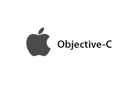

`Objective C`/`iOS`学习
================================

书籍
----------------------

### `Objective C`语言

#### 入门

- ***Programming in Objective-C (6th Edition)***   
    这本优先从`Objective C`入门。本人是先看这本。
- ***Objective-C Programming: The Big Nerd Ranch Guide (2nd Edition)***  
    这本先讲`C`，再过渡到`Objective C`。

学习一样的新事物，理解新事物的方式、风格和理念是非常重要的。  

> 大家应该看过`C`程序员写的`Java`代码，或是`Java`程序员写的`C`代码。
> 这样的代码，风格上一眼就能看出来。
> 如果说风格是不重要的，这样与圈子不一致的风格反映对圈子理解得不深入，是可以推断出代码可信任度不高的。
> 因为，圈子里强调的风格（尤其是一致的部分）实际上是这个圈子里的老手反复思考权衡传播的结果！

个人推荐无论是否有`C`的基础都从第一本书开始看。
如果觉得`C`的基础不够，可以以第二本作为辅助，`Objective C`主题的书能适度深度地讲解`C`。

#### 深入

- ***Pro Multithreading and Memory Management for iOS and OS X: with ARC, Grand Central Dispatch, and Blocks***
- ***Effective Objective-C 2.0: 52 Specific Ways to Improve Your iOS and OS X Programs***

`Objective C`是`C`的超级，即以`C`基础；并且`Objective C`的运行时构建在`C`上，用`C`实现。所以熟练使用`C`是标配。

这里列几本`C`的经典：

- `K&R`的 ***C程序设计语言***
- ***C专家编程***
- ***C陷阱与缺陷***  
PS：这本书很薄170页，定价30，一页的定价感觉远超这本书所在年份的平均～
- ***C和指针***

PS：

- ***The C Preprocessor***  
`C`的预处理器文档。实际上，平时只就会简单用用。  
如一套代码可以分不同环境编译会用到`#ifdef`之类，可以了解一下，有备无患。

#### 书籍豆列

更多内容书籍参见我整理的豆列：

- [`Objective C`/`Xcode`](http://www.douban.com/doulist/37581469/)
- [`C`](http://www.douban.com/doulist/1767907/)

### `Xcode`

`Xcode`不仅仅是个苹果官方提供的强大`IDE`，同时包含了强大的整套工具（各种性能分析器、构建命令行等等），这些对于整个软件开发过程非常有用和重要。

#### 书籍豆列

更多内容书籍参见我整理的豆列：

- [`Objective C`/`Xcode`](http://www.douban.com/doulist/37581469/)

### `iOS`

#### 入门

- ***iOS Programming: The Big Nerd Ranch Guide (4th Edition)***
- ***The Core iOS Developer's Cookbook (5th Edition)***
- ***iOS 7 Programming Cookbook***

#### 深入

- ***iOS Components and Frameworks: Understanding the Advanced Features of the iOS SDK***
- ***iOS Hacker's Handbook***
- ***iOS Core Animation: Advanced Techniques***  

另外，`iOS`开发是界面，有必要看些用户交互：

- ***移动应用界面设计***
- ***简约至上***

#### 书籍豆列

更多内容书籍参见我整理的豆列：

- [`iOS`](http://www.douban.com/doulist/37373330/)

### 设计

- ***Cocoa Design Patterns***

设计往往是独立于语言的，可以过一下以了解`Objective C`下的风格。

### 工程实践

- ***Test-Driven iOS Development***

写`UT`是软件工程实践的 **标配** ！  
用完即扔的脚本不在上面说的范围中，你懂得～

### PS

新鲜或热门的书可以在`Amazon`上搜索了解：

- [`Objective C`](http://www.amazon.com/s/ref=nb_sb_noss?url=node%3D5&field-keywords=objective+c)
    - [`C`](http://www.amazon.com/s/ref=nb_sb_noss?url=node%3D5&field-keywords=C)
- [`iOS`](http://www.amazon.com/s/ref=nb_sb_noss?url=node%3D5&field-keywords=iOS)

代码
----------------------

Read the fucking source code! 读靠谱的代码，学习模仿是获取精髓的好方法！  
＃ 这里列的会更关注`SDK`/库/框架类的代码。

- `AWS`的移动服务`iOS` `SDK`： https://github.com/aws/aws-sdk-ios/  
    `AWS`移动服务介绍：http://aws.amazon.com/cn/mobile/

工具
----------------------

### `iOS`库开发

- [Creating a Static Library in iOS Tutorial](http://www.raywenderlich.com/41377/creating-a-static-library-in-ios-tutorial)
